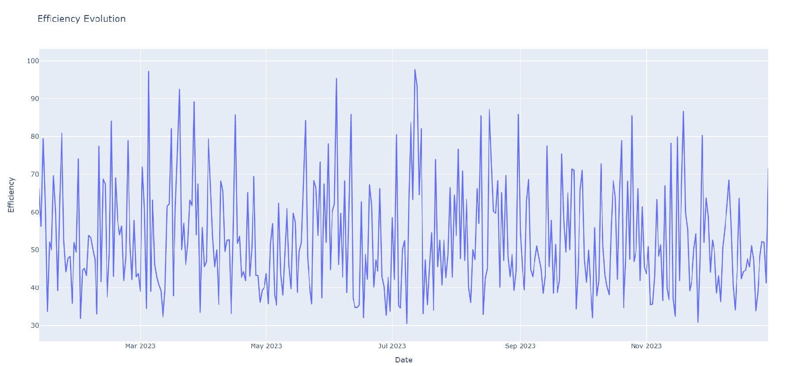

<p align="center">
   
</p>
<p align="center">
  
</p>


# Burner's efficiency calculator for Asphalt plant
This project consists of several scripts and files designed to calculate and visualize the efficiency of a burner, as well as predict the burner power using a neural network model.


---
## How to Use

This project consists of scripts and files for calculating burner efficiency and predicting burner power. Follow the steps below to download, install the necessary libraries, and execute the code using the Windows cmd console.

### Prerequisites

- Python 3.11.4 or later installed on your system. You can download the latest version of Python from [the official website](https://www.python.org/downloads/).

### Installation (for Windows)

1. Clone the repository to your local machine:

```
git clone https://github.com/deusersXaipi/burner_efficiency_calc.git
```
2. Navigate to the project directory:
```
cd your_repository
```
3. Create a virtual environment (optional but recommended):
```
python -m venv venv
```
4. Activate the virtual environment
```
venv\Scripts\activate
```
5. Install the required libraries:
```
pip install -r requirements.txt
```

### Usage
> Note: You can run the code as it is since the `data.csv` file contains sample data. However, if you wish to test the code with your own data, you need to replace the example `data.csv` file with your original data (keeping the same structure and column names) and then execute the `train_model.pyc` file with the argument of `data.csv`. This will create a new `model.keras` file with weights tailored to your data.


Once you have installed the required libraries, you can use the scripts to calculate burner efficiency and predict burner power. Here are the available commands:

- **Calculate efficiency:** Run the `main.py` script with the `calculate_efficiency` function. Example:
```
python main.py calculate_efficiency
```
<p align="center">
   
</p>

- **Plot efficiency evolution:** Run the `main.py` script with the `plot_efficiency_evolution` function. Example:
```
python main.py plot_efficiency_evolution
```
- **Plot correlation heatmap:** Run the `main.py` script with the `plot_correlation_heatmap` function. Example:
```
python main.py plot_correlation_heatmap
```
- **Plot 3D scatter plot:** Run the `main.py` script with the `plot_3d_scatter` function. Example:
```
python main.py plot_3d_scatter
```
- **Plot density heatmap:** Run the `main.py` script with the `plot_density_heatmap` function. Example:
```
python main.py plot_density_heatmap
```
- **Predict burner power:** Run the `main.py` script with the `predict_burner_power` function, providing the required arguments **`--material`**, **`--temperature`**, and **`--model_file`**.
Remember that them material Example:
```
python main.py predict_burner_power --material 150123 --temperature 200 --model_file model.keras
```
> Note: Please ensure that the material is in kilograms and the temperature is in degrees Celsius. The model file is named "model.keras".
